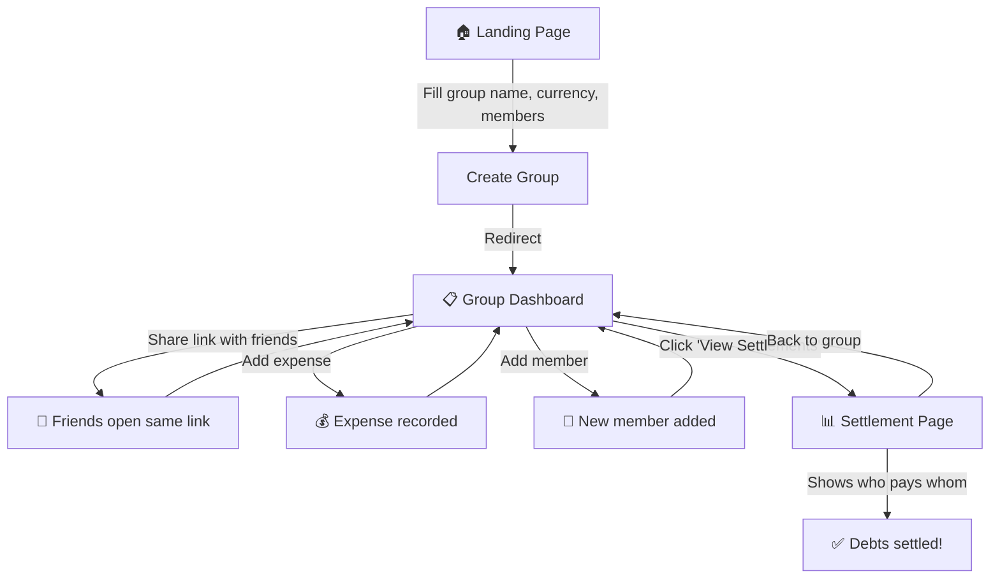

# Split Expenses — Implementation Plan

A **Progressive Web App (PWA)** for tourist/pilgrimage groups to track shared expenses and settle debts with minimal transactions. Built with **Flask + SQLite** backend, **plain HTML/CSS/JS** frontend, hosted on **PythonAnywhere**. Installable on any device — works like a native app on phones, tablets, and desktops.

---

## Core Concept

> **No Login Required.** A group creator gets a unique shareable link (UUID-based). Anyone with the link can add expenses and view settlements — perfect for short-lived travel groups where asking everyone to register is impractical.

---

## User Review Required

> [!IMPORTANT]
> **Access Model — Link-based (no authentication)**
> To keep things simple and frictionless (as you requested "easy session/access"), the app uses **shareable links** instead of user accounts. Anyone with the group link can add/edit expenses. This is similar to how Google Docs "anyone with the link" sharing works. If you'd prefer password-protected groups or user accounts, let me know.

> [!IMPORTANT]
> **Database — SQLite**
> SQLite is the simplest option for PythonAnywhere's free tier and fits a low-to-medium traffic app well. If you expect heavy concurrent usage, we could upgrade to MySQL (available free on PythonAnywhere). For now, SQLite is recommended.

> [!IMPORTANT]
> **Currency Handling**
> The app will support multi-currency by letting the group creator choose a base currency at group creation. All expenses within a group use the same currency. If you need mixed currencies within a single group (e.g., some expenses in INR, others in USD, with live conversion), please let me know — it adds significant complexity.

---

## Open Questions

1. **Expense Categories** — Should we include predefined categories like Food, Transport, Tickets, Accommodation, Prasadham, etc.? Or let users type freeform descriptions?
2. **Edit/Delete** — Should any group member be able to edit or delete any expense, or only the person who entered it? (Since there are no accounts, restricting edits is tricky.)
3. **Export** — Do you want the ability to export the expense summary / settlement as PDF or CSV?
4. **History** — Should settled groups be archivable or deletable?

---

## Proposed Changes

### Project Structure

```
Split Expenses/
├── app/
│   ├── __init__.py          # Flask app factory
│   ├── models.py            # SQLAlchemy models (Group, Member, Expense)
│   ├── routes.py            # All route handlers
│   ├── settlement.py        # Debt minimization algorithm
│   ├── static/
│   │   ├── css/
│   │   │   └── style.css    # All styles (responsive, mobile-first)
│   │   ├── js/
│   │   │   └── app.js       # Frontend interactivity + PWA install prompt
│   │   ├── manifest.json    # PWA manifest — app name, icons, theme
│   │   ├── service-worker.js # PWA service worker — caching & offline
│   │   └── icons/
│   │       ├── icon-192.png  # PWA icon (192×192)
│   │       └── icon-512.png  # PWA icon (512×512)
│   └── templates/
│       ├── base.html        # Base layout with nav + PWA meta tags
│       ├── index.html       # Landing page — create group
│       ├── group.html       # Group dashboard — expenses list + add form
│       └── settlement.html  # Settlement results page
├── config.py                # App configuration
├── wsgi.py                  # PythonAnywhere WSGI entry point
├── requirements.txt         # Python dependencies
└── README.md                # Setup & deployment docs
```

---

### 1. Database Models (`app/models.py`)

Three tables using **Flask-SQLAlchemy**:

#### `Group`
| Column       | Type         | Notes                                      |
|-------------|-------------|---------------------------------------------|
| `id`         | Integer (PK) | Auto-increment                              |
| `uuid`       | String(36)   | UUID4, used in URLs for access              |
| `name`       | String(100)  | Group name (e.g., "Tirupati Trip 2026")     |
| `currency`   | String(3)    | ISO currency code (INR, USD, EUR, etc.)     |
| `created_at` | DateTime     | Auto-set on creation                        |

#### `Member`
| Column      | Type         | Notes                                     |
|------------|-------------|-------------------------------------------|
| `id`        | Integer (PK) | Auto-increment                            |
| `group_id`  | Integer (FK) | References `Group.id`                     |
| `name`      | String(50)   | Member's display name                     |
| `created_at`| DateTime     | Auto-set on creation                      |

#### `Expense`
| Column        | Type          | Notes                                        |
|--------------|--------------|----------------------------------------------|
| `id`          | Integer (PK)  | Auto-increment                               |
| `group_id`    | Integer (FK)  | References `Group.id`                        |
| `paid_by_id`  | Integer (FK)  | References `Member.id` — who paid            |
| `amount`      | Float         | Amount in group's currency                   |
| `description` | String(200)   | What the expense was for                     |
| `category`    | String(50)    | Predefined category                          |
| `split_among` | Text (JSON)   | JSON array of `Member.id`s sharing this cost |
| `created_at`  | DateTime      | Auto-set on creation                         |

---

### 2. Backend Routes (`app/routes.py`)

| Method | Route                           | Purpose                                   |
|--------|--------------------------------|-------------------------------------------|
| GET    | `/`                            | Landing page — create a new group         |
| POST   | `/create`                      | Create group + initial members            |
| GET    | `/group/<uuid>`                | Group dashboard — list expenses, add form |
| POST   | `/group/<uuid>/add-member`     | Add a new member to the group             |
| POST   | `/group/<uuid>/add-expense`    | Record a new expense                      |
| POST   | `/group/<uuid>/delete-expense/<id>` | Remove an expense                   |
| GET    | `/group/<uuid>/settle`         | Calculate & display settlements           |
| GET    | `/api/group/<uuid>/data`       | JSON API — all group data (for JS)        |

---

### 3. Settlement Algorithm (`app/settlement.py`)

**Greedy debt minimization** — the industry-standard approach used by Splitwise:

```
1. For each expense, calculate each member's share (amount / number_of_splitters)
2. Calculate net balance per member:
     net = total_paid − total_owed
3. Separate into creditors (net > 0) and debtors (net < 0)
4. Sort both lists by absolute balance (descending)
5. Match largest debtor → largest creditor:
     transfer = min(|debtor_balance|, creditor_balance)
     Record: "Debtor pays Creditor ₹transfer"
     Update both balances
6. Repeat until all balances = 0
```

This produces at most **N−1 transactions** for N people.

---

### 4. Frontend Pages

#### Landing Page (`index.html`)
- Hero section with app name and tagline
- Form: Group Name, Currency selector (dropdown with 15+ popular currencies), Initial member names (dynamic — add/remove fields)
- "Create Group" button → redirects to group dashboard

#### Group Dashboard (`group.html`)
- **Header**: Group name, currency, shareable link with copy button
- **Members section**: List of members + "Add Member" button
- **Add Expense form**: Who paid (dropdown), Amount, Description, Category (dropdown), Split among (checkboxes, default: all members)
- **Expenses table**: Date, Description, Category, Paid By, Amount, Split Among, Delete button
- **Total summary bar**: Total group spending
- **"View Settlements" button** → navigates to settlement page

#### Settlement Page (`settlement.html`)
- **Per-person summary**: Cards showing each member's total spent vs. total share
- **Settlement transactions**: Clear cards showing "Person A pays Person B ₹X"
- **Visual balance bar**: Color-coded bars showing who is owed vs who owes
- Back button to group dashboard

---

### 5. Supported Currencies

The dropdown will include these currencies (symbol + name):

| Code | Symbol | Name               |
|------|--------|--------------------|
| INR  | ₹      | Indian Rupee       |
| USD  | $      | US Dollar          |
| EUR  | €      | Euro               |
| GBP  | £      | British Pound      |
| JPY  | ¥      | Japanese Yen       |
| AUD  | A$     | Australian Dollar  |
| CAD  | C$     | Canadian Dollar    |
| SGD  | S$     | Singapore Dollar   |
| AED  | د.إ    | UAE Dirham         |
| THB  | ฿      | Thai Baht          |
| MYR  | RM     | Malaysian Ringgit  |
| LKR  | Rs     | Sri Lankan Rupee   |
| NPR  | रू     | Nepalese Rupee     |
| IDR  | Rp     | Indonesian Rupiah  |
| PHP  | ₱      | Philippine Peso    |

---

### 6. UI Design Approach

Since you requested **simple CSS, HTML & JavaScript**:

- **Single CSS file** — modern but lightweight. Uses CSS variables for theming
- **No framework** — no Bootstrap, no Tailwind. Pure vanilla CSS
- **Mobile-first responsive** — designed for phones first, scales up to tablets & desktops
- **Touch-friendly** — minimum 48×48px tap targets, large form inputs, swipe-friendly cards
- **Color palette** — warm travel-themed tones (deep teal primary, amber accents, clean whites)
- **Micro-animations** — subtle hover effects, smooth form transitions
- **Google Font** — "Inter" for clean readability

#### Responsive Breakpoints

| Breakpoint     | Width         | Layout                                        |
|---------------|---------------|-----------------------------------------------|
| **Mobile**     | < 600px       | Single column, stacked cards, hamburger nav   |
| **Tablet**     | 600–1024px    | Two-column where appropriate, side-by-side    |
| **Desktop**    | > 1024px      | Max-width container, spacious grid layouts    |

---

### 7. Progressive Web App (PWA)

The app will be a fully installable PWA — users can **"Add to Home Screen"** on any device and use it like a native app.

#### `manifest.json`
```json
{
  "name": "Split Expenses",
  "short_name": "SplitExp",
  "description": "Split travel expenses with your group",
  "start_url": "/",
  "display": "standalone",
  "background_color": "#0f172a",
  "theme_color": "#0d9488",
  "icons": [
    { "src": "/static/icons/icon-192.png", "sizes": "192x192", "type": "image/png" },
    { "src": "/static/icons/icon-512.png", "sizes": "512x512", "type": "image/png" }
  ]
}
```

#### `service-worker.js` — Caching Strategy

| Resource Type    | Strategy        | Rationale                                          |
|-----------------|----------------|----------------------------------------------------|
| Static assets    | **Cache First** | CSS, JS, fonts — rarely change, fast repeat loads  |
| HTML pages       | **Network First** | Always try to get fresh page, fall back to cache |
| API calls        | **Network Only** | Expense data must always be current              |

**Offline behavior**: When offline, the app shows cached pages with a subtle "You're offline" banner. Users can view their last-loaded group data but cannot add/edit expenses until reconnected.

#### `base.html` — PWA Meta Tags
```html
<!-- PWA -->
<link rel="manifest" href="/static/manifest.json">
<meta name="theme-color" content="#0d9488">
<meta name="apple-mobile-web-app-capable" content="yes">
<meta name="apple-mobile-web-app-status-bar-style" content="black-translucent">
<link rel="apple-touch-icon" href="/static/icons/icon-192.png">

<!-- Viewport for responsive design -->
<meta name="viewport" content="width=device-width, initial-scale=1.0, maximum-scale=5.0">
```

#### Install Prompt (in `app.js`)
The app will listen for the `beforeinstallprompt` event and show a friendly **"Install App"** button in the header when the browser supports it. This gives users a one-tap install experience.

#### PWA Benefits for This App
- 📱 **Home screen icon** — opens fullscreen, no browser chrome
- ⚡ **Faster loads** — static assets cached locally after first visit
- 🔔 **App-like feel** — standalone display mode, custom splash screen
- 🌐 **Works across all devices** — same URL, adapts to any screen size
- 📴 **Offline viewing** — cached group data viewable without internet

---

### 8. Configuration & Deployment Files

#### [NEW] `config.py`
- `SECRET_KEY` from environment variable
- `SQLALCHEMY_DATABASE_URI` pointing to SQLite file
- Separate `DevelopmentConfig` and `ProductionConfig`

#### [NEW] `wsgi.py`
- PythonAnywhere WSGI entry point
- Adds project to `sys.path`
- Calls `create_app()`

#### [NEW] `requirements.txt`
```
Flask==3.1.*
Flask-SQLAlchemy==3.1.*
```

---

## User Flow Diagram



---

## Verification Plan

### Automated Tests
- Unit tests for the settlement algorithm with various edge cases:
  - All equal spending → no settlements needed
  - One person paid everything → everyone pays that person
  - 2 people, 5 people, 10 people scenarios
  - Floating point precision handling
- Route tests for create group, add expense, delete expense
- Run with: `python -m pytest tests/`

### Manual Verification
- Create a group with 4 members, add 5-6 expenses with different payers and split combinations
- Verify settlement calculations match manual math
- Test the shareable link in a different browser/incognito
- Test responsiveness on mobile, tablet, and desktop viewports
- Verify PWA install prompt appears in Chrome/Edge
- Test "Add to Home Screen" on a mobile device
- Verify service worker caches static assets on first load
- Test offline mode — cached pages should display with offline banner
- Run Lighthouse PWA audit in Chrome DevTools (target: all green checks)
- Deploy to PythonAnywhere and verify end-to-end
